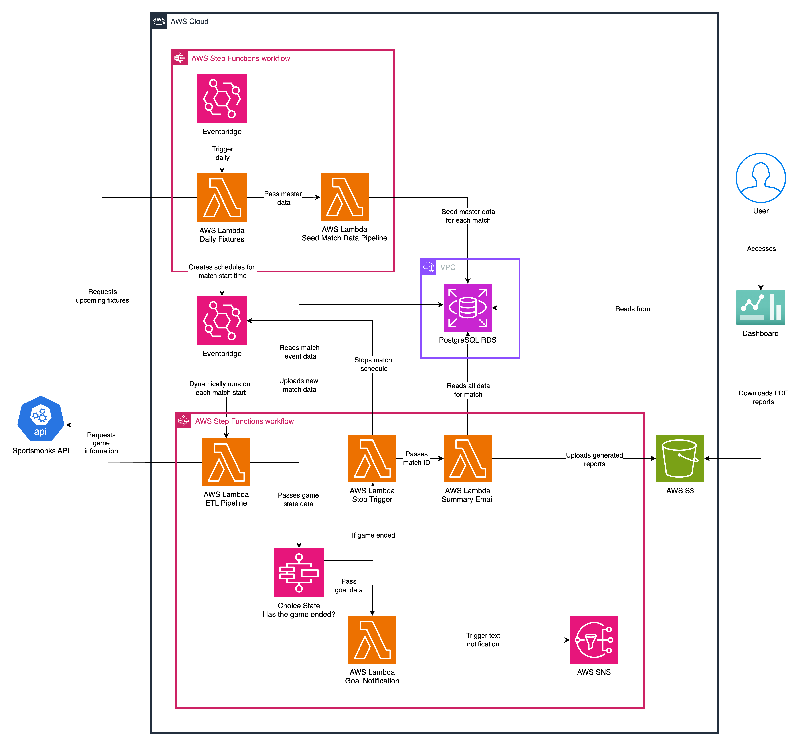

# PlayByPlay Insights Football Project

## Summary

A solution to the current gap in how football matches are reviewed and analysed, through our dynamic, data-driven dashboard.

## Deliverables

- A full E.T.L data pipeline, hosted in the cloud on AWS.
- A streamlit dashboard for both real-time and historical visualisations of our data.

## Setup

1) To begin setup of the project, navigate to the `/architecture` subdirectory and follow the steps in the README.
2) Navigate to `/pipeline` and create an `.env` as instructed in the README.
3) Navigate to `/architecture` and run the following bash commands to push Docker images to the different ECR's:
- `bash push_ecr_pipeline.sh`
- `bash push_ecr_scheduler.sh`
- `bash push_ecr_seeder.sh`
- `bash push_ecr_stop_trigger.sh`
- `bash push_ecr_report.sh`
- `bash push_ecr_notification.sh`
5) Finally, navigate to `/dashboard` and follow the steps in the README to setup the streamlit dashboard.

## Architecture 

#### System architecture diagram:

Note: these are stored in `/architecture`.
  
## Roles

| Member    | Role                              |
|-----------|-----------------------------------|
| Ahmet     | Data Engineer, Project Manager    |
| Berkant   | Data Engineer, Quality Assurance  |
| James     | Data Engineer, Architect          |
| Raphael   | Data Engineer, Architect          |

## Technology

- Python - boto3, pandas, psycopg2, streamlit, pylint, pytest
- AWS - S3, Step Functions, EventBridge, SNS, Lambda Functions, RDS
- Docker
- Terraform
- PostgreSQL
- Streamlit - Streamlit Community Cloud
- CI/CD

## Testing

Our subdirectories contain their own testing files. If you want to run an overall coverage check, after installing requirements run `pytest --cov`.

