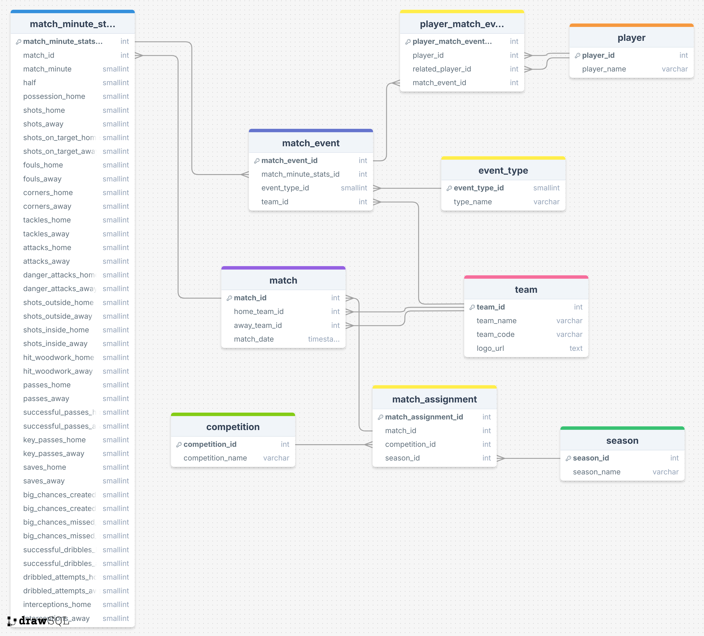

# Database Architecture

## Setup

1) Create a `.env` with the following keys:
```
DB_USER=[DATABASE USERNAME]
DB_NAME=[DATABASE NAME]
DB_PASS=[DATABASE PASSWORD]
DB_PORT=[DATABASE PORT]
DB_HOST=[DATABASE HOST]
```  
2) Run `bash setup_db.sh`

#### Entity Relationship Diagram
