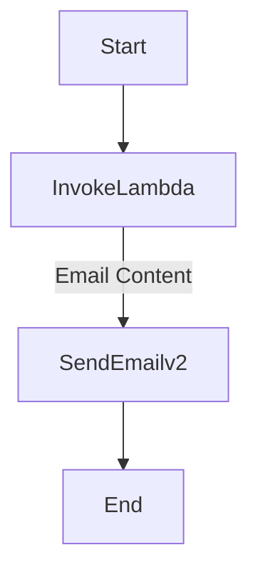

# Writing Emails In AWS
- This is in an instructional guide for sending email notifications using AWS
## Lambda
- Contain your solution code inside of a lambda handler
- This must take event and context
- This must return status and message:
    - **function signiature**
    ```python
    def lambda_handler(event, context):
    ```
    - **function return**
    ```python
    return {
            "statusCode": 200,
            "message": pdf_string
        }
    ```
### [OPTIONAL] Generate HTML
- To create nicely formatted content for email
- Create however you would like using HTML tags and store as a string
### Generate PDF with lambda
- Many librariers can be used
- I reccommend
    - `xhtml2pdf`
- This library integrates well with html content
- Use `xhtml2pdf.pisa`
```python
pdf = pisa.CreatePDF(
        <html-data>,
        dest=result_file
    )
```
### Generate message with Lambda
- You will need these builtin imports
    - `from email.mime.multipart import MIMEMultipart`
    - `from email.mime.text import MIMEText`
    - `from email.mime.application import MIMEApplication`
    - `from os.path import basename`
- Create a message and message body as MIME multiparts
- Attach MIME headers for formatting
```python
def get_message(path_to_pdf: str) -> str:
    """Return raw message string from pdf file."""
    msg = MIMEMultipart('mixed')
    msg['Subject'] = <email-subject>
    msg['From'] = <SES-email>
    msg['To'] = <SES-email>
    msg_body = MIMEMultipart('alternative')
    body_text = "See attachment for email."
    textpart = MIMEText(body_text, 'plain')
    msg_body.attach(textpart)
```
- Attach the content of the pdf file
```python
with open(path_to_pdf, 'rb') as f:
        part = MIMEApplication(f.read())
        part.add_header('Content-Disposition', 'attachment',
                        filename=basename(<path_to_pdf>))
        msg.attach(part)
``` 
### Dockerise Lambda
- For creating the image of the lambda
```Dockerfile
FROM public.ecr.aws/lambda/python:latest
WORKDIR ${LAMBDA_TASK_ROOT}
COPY requirements.txt .
RUN pip install --no-cache-dir -r requirements.txt
COPY <script-name>.py .
CMD [ "<script-name>.lambda_handler" ]
```
### Upload to AWS
- Push this image to an ECR
- Build a lambda from that ECR image
- It will need permissions in a role to function
- At base level for logs it needs
```tf
{
    Sid    = "CloudWatchLogs",
    Effect = "Allow",
    Action = [
        "logs:CreateLogGroup",
        "logs:CreateLogStream",
        "logs:PutLogEvents"
    ],
    Resource = "*"
}
```
- It will need other permissions if you lambda contacts other AWS resources
## State Machine
- Simple state machine
- Links Lambda and Simple Email Service

### Configuration
- The lambda will output the message to the next state
- In `SendEmailv2` you need this inside `Arguments`
```
{
  "Content": {
    "Raw": {
      "Data": ""
    }
  },
  "Destination": {
    "ToAddresses": [
      <SES-email>
    ]
  },
  "FromEmailAddress": <SES-email>
}
```